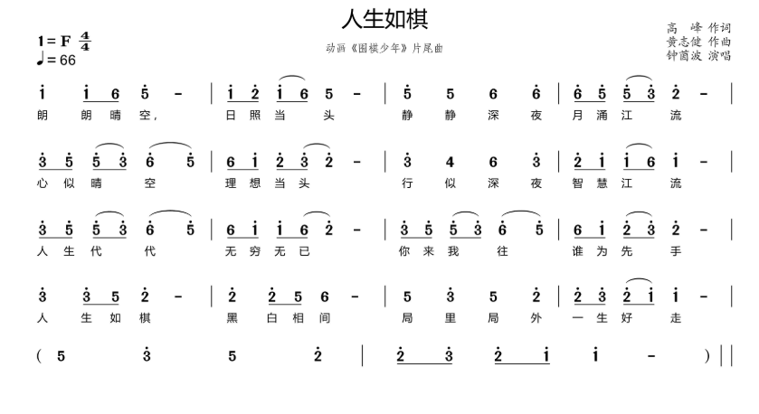
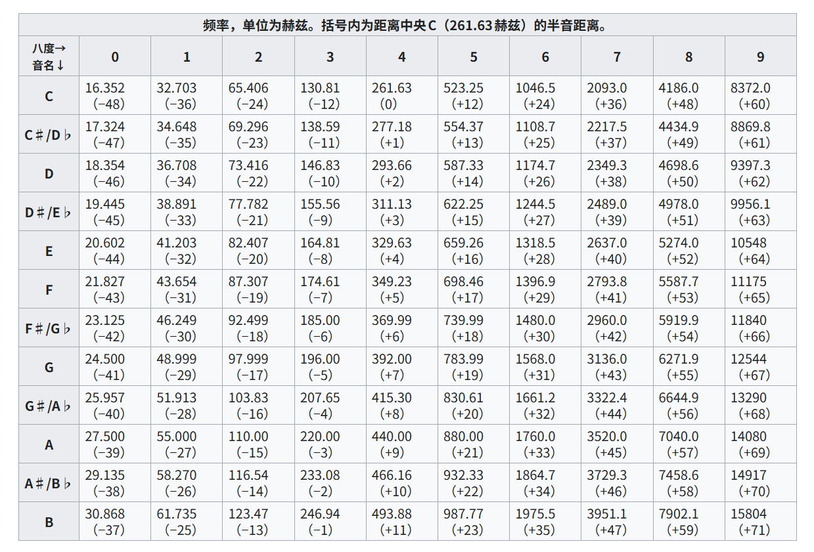
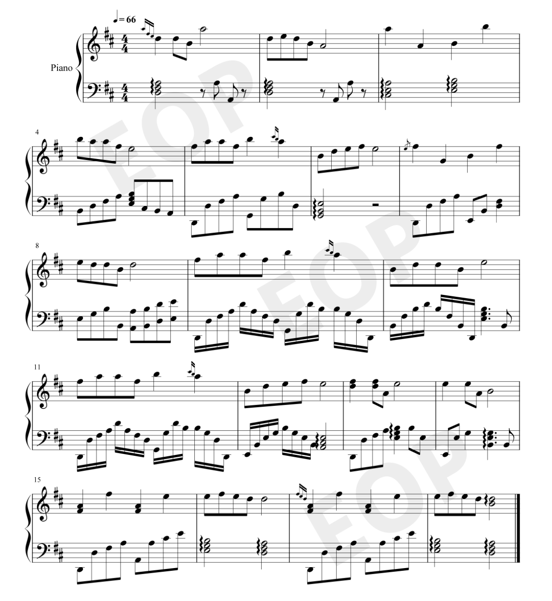

## 引言

**记谱法**是将音乐记录下来的方法。由于历史、地域、技术等原因，人类发明了多种记谱法来记录音乐。本文档将介绍五种最常用的记谱法：简谱、科学记谱法、五线谱、ABC 记谱法和 MIDI 记谱法。

> 简单来说：科学记谱法是"身份证号"，简谱是"口头小名"，五线谱是"高精度彩色照片"，ABC 记谱法是"照片底片（供机器读取）"，MIDI 记谱法是"数字坐标"。

---

## 简谱

简谱（Numbered Notation）是一种用数字 1-7 表示音高的记谱法，因其简单易学，在中国、日本等国家广泛使用。

### 基本规则

简谱使用 **1、2、3、4、5、6、7** 七个数字表示音名（在 C 大调下）：

| 简谱 | 唱名 | 音名 (C大调) | 与下一音的音程 |
|------|------|--------------|----------------|
| 1 | Do | C | 全音 ↑ |
| 2 | Re | D | 全音 ↑ |
| 3 | Mi | E | 半音 ↑ |
| 4 | Fa | F | 全音 ↑ |
| 5 | Sol | G | 全音 ↑ |
| 6 | La | A | 全音 ↑ |
| 7 | Si | B | 半音 ↑ (到下一个八度的 1) |

> **音阶规律**：C 大调音阶的音程结构是"全-全-半-全-全-全-半"，这是自然大调的标准结构。

### 音高表示

简谱用数字表示音高，通过**上下点**表示不同的八度：

| 区域 | 表示方法 | 对应音高 | 示例 |
|------|----------|----------|------|
| 高音区 | 数字上方加一点 | 高八度 | `1̇` = C5，`5̇` = G5 |
| 中音区 | 数字无点 | 基准八度 | `1` = C4（在 1=C 时） |
| 低音区 | 数字下方加一点 | 低八度 | `1̲` = C3，`5̲` = G3 |

> **规律**：每加一个点，音高变化一个八度（十二个半音）。

```
高音区：1̇  2̇  3̇  4̇  5̇  6̇  7̇
中音区：1   2   3   4   5   6   7
低音区：1̲  2̲  3̲  4̲  5̲  6̲  7̲
```

### 升降号

简谱中升降号写在音符的**右上方**或**右下方**：

| 符号 | 名称 | 效果 | 示例 |
|------|------|------|------|
| `#` 或 `♯` | 升号 | 升高半音 | `#4` 或 `♯4` = 升 Fa |
| `b` 或 `♭` | 降号 | 降低半音 | `b7` 或 `♭7` = 降 Si |
| `×` 或 `##` | 重升号 | 升高全音 | `×4` = 双重升 Fa |
| `bb` | 重降号 | 降低全音 | `bb7` = 双重降 Si |
| `♮` | 还原号 | 还原到原音 | 还原之前的升降音 |

### 调号

简谱通过 `1 = X` 来表示调性，表示**主音（Do）对应某个音名**。这里的音名通常是**小字一组**的音（即 C4-B4 区域）：

| 调号 | 主音位置 | 对应调 | 主音频率 | 调号音（升降） |
|------|----------|--------|----------|----------------|
| `1 = C` | C4 | C 大调 / a 小调 | 261.63 Hz | 无升降号 |
| `1 = G` | G4 | G 大调 / e 小调 | 392.00 Hz | 升 #4 (F♯) |
| `1 = D` | D4 | D 大调 / b 小调 | 293.66 Hz | 升 #4、#1 (F♯、C♯) |
| `1 = A` | A4 | A 大调 / #f 小调 | 440.00 Hz | 升 #4、#1、#5 (F♯、C♯、G♯) |
| `1 = E` | E4 | E 大调 / #c 小调 | 329.63 Hz | 升 #4、#1、#5、#2 (F♯、C♯、G♯、D♯) |
| `1 = B` | B4 | B 大调 / #g 小调 | 493.88 Hz | 升 #4、#1、#5、#2、#6 (F♯、C♯、G♯、D♯、A♯) |
| `1 = F` | F4 | F 大调 / d 小调 | 349.23 Hz | 降 b7 (B♭) |
| `1 = B♭` | B♭4 | B♭ 大调 / g 小调 | 466.16 Hz | 降 b7、b3、b6 (B♭、E♭、A♭) |
| `1 = E♭` | E♭4 | E♭ 大调 / c 小调 | 311.13 Hz | 降 b7、b3、b6、b2 (B♭、E♭、A♭、D♭) |
| `1 = A♭` | A♭4 | A♭ 大调 / f 小调 | 415.30 Hz | 降 b7、b3、b6、b2、b5 (B♭、E♭、A♭、D♭、G♭) |

> **重要说明**：`1 = C` 中的 `C` 是指 **C4（中央 C，261.63 Hz）**，`1 = D` 中的 `D` 是指 **D4（293.66 Hz）**，以此类推。简谱的调号决定了唱名与绝对音高的对应关系。

### 拍号与时值

简谱用 **X. =** 表示拍号，如 `4/4` 或 `2/4`；用下划线表示音符时值：

| 音符 | 时值（四四拍） | 表示方法 |
|------|---------------|----------|
| 全音符 | 4 拍 | 1 — — |
| 二分音符 | 2 拍 | 1 - |
| 四分音符 | 1 拍 | 1 |
| 八分音符 | 1/2 拍 | 1 下方加横线 |
| 十六分音符 | 1/4 拍 | 1 下方加双横线 |

### 休止符

简谱中用数字 **0** 表示休止（静音），下划线表示不同时值：

| 休止符 | 时值 | 表示方法 |
|--------|------|----------|
| 全休止符 | 整小节（四四拍为 4 拍） | 整小节留空，或写 0 标记 |
| 二分休止符 | 2 拍 | 0 写在第二线上方 |
| 四分休止符 | 1 拍 | 0 写在第二线下方 |
| 八分休止符 | 1/2 拍 | 0 下方加横线 |
| 十六分休止符 | 1/4 拍 | 0 下方加双横线 |

### 简谱示例



---

## 科学记谱法

科学记谱法（Scientific Pitch Notation，简称 SPN）是一套给声音"精准定位"的全球标准命名系统，也称为**音名记谱法**。

### 基本规则

用 **音名 + 八度数字** 的方式表示音高：

- 音名：C、D、E、F、G、A、B（白键）
- 升降音：C♯/D♭、D♯/E♭、F♯/G♭、G♯/A♭、A♯/B♭

```
八度      │  音名序列（从低到高）
──────────┼──────────────────────────────────────
 小字五组  │  C8（钢琴最高音）
 小字四组  │  C8 → B7 → ... → C7
 小字三组  │  C7 → B6 → ... → C6
 小字二组  │  C6 → B5 → ... → C5
 小字一组  │  C5 → B4 → ... → C4（中央 C 区域）
 小字组    │  C4 → B3 → ... → C3
 大字组    │  C3 → B2 → ... → C2
 大字一组  │  C2 → B1 → ... → C1
 大字二组  │  C1 → A0（钢琴最低音）
```

> **说明**：每个八度包含 12 个音（7 个白键 + 5 个黑键），从 C 开始到 B 结束。中央 C = C4 = 小字一组 C。

### 标准音高

| 基准音 | 频率 | 说明 |
|--------|------|------|
| **A4** | 440 Hz | 国际标准音（交响乐团校准音） |
| **C4** | 261.63 Hz | 中央 C（钢琴正中央的键） |

### 钢琴音域

标准 88 键钢琴的音域是 **A0 - C8**（共 88 个音）：

| 区域 | 音高范围 | MIDI | 八度 |
|------|----------|------|------|
| 最低音 | A0 | 21 | 大字二组 |
| 低音区 | A0 - F2 | 21-53 | 大字二组 ~ 大字组 |
| 中音区 | F♯2 - F4 | 54-77 | 大字组 ~ 小字一组 |
| 高音区 | F♯4 - C8 | 78-108 | 小字二组 ~ 小字五组 |

> **说明**：中央 C (C4) 位于中音区，是钢琴键盘正中央的键。



---

## 五线谱

五线谱（Staff Notation）是音乐史上最精确的记谱法，用"二维坐标"表示音乐：X 轴看时值，Y 轴看音高。

### 基本元素

| 元素 | 定义 |
|------|------|
| **谱表** | 五条平行横线的整体 |
| **线** | 五条实心横线，从下往上依次为第一线 ~ 第五线 |
| **间** | 线之间的空白区域，从下往上依次为第一间 ~ 第四间 |
| **上加线/间** | 谱表上方的附加线 |
| **下加线/间** | 谱表下方的附加线 |

### 谱号

谱号用于确定五线谱上各线和间所代表的实际音高：

| 谱号 | 位置 | 代表音 | 应用 |
|------|------|--------|------|
| 高音谱号 (𝄞) | 第二线 | **G4** | 小提琴、女高音、高音乐器 |
| 低音谱号 (𝄢) | 第四线 | **F3** | 大提琴、贝斯、低音乐器 |
| 中音谱号 (𝄡) | 第三线 | **C4** | 中提琴、大管 |

### 谱表示例

**高音谱表**（第二线 = G4，下加一线 = C4）：

<YueLiNotes notationType="abc" notes="X:1
M:4/4
L:1/4
Q:60
K:C
G A B c | d e f g
" :showSheetMusic="true" :showNotes="false" :showTitle="false" />

**中音谱表**（第三线 = C4）：

<YueLiNotes notationType="abc" notes="X:1
M:4/4
L:1/4
Q:60
K:C clef=alto
C D E F | G A B c
" :showSheetMusic="true" :showNotes="false" :showTitle="false" />

**低音谱表**（第四线 = F3）：

<YueLiNotes notationType="abc" notes="X:1
M:4/4
L:1/4
Q:60
K:C clef=bass
C D E F | G A B c
" :showSheetMusic="true" :showNotes="false" :showTitle="false" />

### 音符时值

| 音符 | 形状 | 四四拍时值 |
|------|------|-----------|
| 全音符 | 空心椭圆 | 4 拍 |
| 二分音符 | 空心椭圆 + 符干 | 2 拍 |
| 四分音符 | 实心椭圆 + 符干 | 1 拍 |
| 八分音符 | 实心椭圆 + 符干 + 单符尾 | 1/2 拍 |
| 十六分音符 | 实心椭圆 + 符干 + 双符尾 | 1/4 拍 |



---

## ABC 记谱法

ABC 记谱法是一套纯文本的五线谱表示方法，最初于 18 世纪诞生于欧洲，适合计算机处理，可通过 abcjs 等库渲染为五线谱图形。

### 基本规则

ABC 记谱法使用字母表示音名，通过大小写和符号表示八度：

| ABC | 音高 | MIDI | 说明 |
|-----|------|------|------|
| `C,, D,,` | 大写 + 双逗号 | 24-35 | 大字一组 (C2-B2) |
| `C, D, E,` | 大写 + 单逗号 | 36-47 | 大字组 (C2-B3) |
| `C D E F G A B` | 大写字母 | 48-59 | **小字组** (C3-B3) |
| `c d e f g a b` | 小写字母 | 60-71 | **小字一组** (C4-B4)，即中央 C 区域 |
| `c' d' e'` | 小写 + 单引号 | 72-83 | 小字二组 (C5-B5) |
| `c'' d''` | 小写 + 双引号 | 84-95 | 小字三组 (C6-B6) |

> **核心规则**：在 `K:C`（C 大调）调号下，ABC 记谱法中：
> - **小写字母** = 中央 C 区域（C4-B4，MIDI 60-71）
> - **大写字母** = 比中央 C 低一个八度（C3-B3，MIDI 48-59）

### 升降号

| ABC | 说明 | 示例 |
|-----|------|------|
| `^` | 升号 | `^C` = C♯ |
| `_` | 降号 | `_B` = B♭ |
| `=` | 还原号 | `=C` = C (还原) |

### 时值

| 写法 | 说明 |
|------|------|
| `C` | 四分音符 |
| `C2` | 二分音符（延长 2 倍） |
| `C4` | 全音符（延长 4 倍） |
| `C/` | 八分音符（缩短一半） |
| `C/2` | 八分音符 |
| `C3/2` | 三连音（1.5 倍） |

### 常用符号

| 符号 | 说明 |
|------|------|
| `\|` | 小节线 |
| `\|\|` | 双小节线（段落结束） |
| `\|:` | 反复开始 |
| `:\|` | 反复结束 |
| `( )` | 和弦 |
| `-` | 连音线 |
| `z` | 休止符 |

### ABC 谱示例

<YueLiNotes notationType="abc" notes="X:1
T:小星星
M:4/4
L:1/4
Q:120
K:C
C C G G | A A G2 |
F F E E | D D C2 |
" :showSheetMusic="true" :showNotes="true" :showTitle="true" />

### ABC 与调式音级

ABC 记谱法本身不直接标注音级，而是通过调号（K 字段）隐含音级关系。在 `K:C`（C 大调）下：

| 音级 | 唱名 | 科学记谱法 | ABC | 简谱 | MIDI |
|------|------|-----------|-----|------|------|
| I | Do | C4 | **c** | 1 | 60 |
| II | Re | D4 | **d** | 2 | 62 |
| III | Mi | E4 | **e** | 3 | 64 |
| IV | Fa | F4 | **f** | 4 | 65 |
| V | Sol | G4 | **g** | 5 | 67 |
| VI | La | A4 | **a** | 6 | 69 |
| VII | Si | B4 | **b** | 7 | 71 |

> **重要**：ABC 记谱法中，**小写字母**对应 C4-B4（中央 C 区域），**大写字母**对应比中央 C 低一个八度的 C3-B3。

---

## MIDI 记谱法

MIDI（Musical Instrument Digital Interface）是一种技术标准，使用 **0-127** 的数值来表示音高，是计算机音乐制作中最精确的音高表示方法。

### 基本概念

| 概念 | 值 |
|------|-----|
| MIDI 编号范围 | 0 - 127（共 128 个值） |
| 中央 C | MIDI 60 = C4 |
| 标准音高 | MIDI 69 = A4 = 440 Hz |
| 钢琴音域 | MIDI 21 (A0) - 108 (C8) |

### 频率计算公式

**MIDI → 频率**：
\[
f = 440 \times 2^{(m-69)/12}
\]

**频率 → MIDI**：
\[
m = 12 \times \log_2(f/440) + 69
\]

### MIDI 音高对照表

| MIDI | 音名 | 频率 (Hz) | 说明 |
|------|------|-----------|------|
| 21 | A0 | 27.50 | 钢琴最低音 |
| 36 | C2 | 65.41 | 大字组 C |
| 48 | C3 | 130.81 | 小字组 C |
| 60 | **C4** | 261.63 | **中央 C** |
| 69 | **A4** | 440.00 | **国际标准音** |
| 72 | C5 | 523.25 | 小字二组 C |
| 84 | C6 | 1046.50 | 小字三组 C |
| 96 | C7 | 2093.00 | 小字四组 C |
| 108 | C8 | 4186.01 | 钢琴最高音 |

### MIDI 与其他记谱法的对应

| 记谱法 | 中央 C | A4 (440Hz) |
|--------|-------|------------|
| 科学记谱法 | C4 | A4 |
| 简谱 | 1 (中音) | 6 |
| 五线谱 | 高音谱下加一间 | 高音谱第一线（下加一间上方） |
| ABC 记谱法 | c（在 K:C 调下） | a |
| MIDI | **60** | **69** |

### MIDI 的优势

1. **计算机友好**：纯数字表示，便于编程
2. **精确控制**：可精确控制音高、力度、时长
3. **设备兼容**：所有 MIDI 设备互通
4. **数据量小**：比音频文件小得多
5. **可编辑性**：可轻松修改任意参数

---

## 五种记谱法对比

### 核心特点

| 记谱法 | 表示方式 | 精度 | 学习难度 | 主要应用 |
|--------|----------|------|----------|----------|
| 简谱 | 数字 1-7 | 中等 | 简单 | 中国音乐教育、流行音乐 |
| 科学记谱法 | 字母 + 数字 | 高 | 简单 | 声学、电子设备 |
| 五线谱 | 图形 | 最高 | 困难 | 专业音乐、古典音乐 |
| ABC 记谱法 | 纯文本 | 高 | 中等 | 计算机处理、网络传播 |
| MIDI | 数值 0-127 | 最高 | 简单 | 音乐制作、电子乐器 |

### 同一音高的不同表示

以几个关键音为例，展示五种记谱法的对照：

| 音高 | 科学记谱法 | 简谱 (C大调) | 五线谱 | ABC 记谱法 | MIDI |
|------|-----------|--------------|--------|------------|------|
| 中央 C | C4 | 1 | 高音谱下加一间 | c | 60 |
| E4 | E4 | 3 | 下加一间上方第二线 | e | 64 |
| G4 | G4 | 5 | 下加一间上方第三线 | g | 67 |
| A4 (标准音) | A4 | 6 | 高音谱第一线 | a | 69 |
| C5 | C5 | 1̇ (高音) | 高音谱下加一线 | c' | 72 |

> **简谱说明**：简谱的 `1 = C` 表示主音对应 C4（中央 C）。因此在 C 大调下，简谱数字 1-7 对应 C4-B4。

### 互相转换关系

```
科学记谱法 (C4)
    │
    ├── 去掉数字 → 音名 (C)
    │       │
    │       └── 转换为数字 1-7 → 简谱 (1)
    │
    ├── 添加谱表定位 → 五线谱 (下加一间)
    │       │
    │       └── 转换为纯文本 → ABC 记谱法 (c)
    │
    └── 转换为 MIDI 编号 → MIDI (60)
            │
            └── 可计算频率 → 440 × 2^(-9/12) ≈ 261.63 Hz
```

---

## 总结

五种记谱法各有特点，适用于不同场景：

- **简谱**：适合音乐入门、歌曲伴奏
- **科学记谱法**：适合声学研究、精确标注
- **五线谱**：适合专业演奏、古典音乐
- **ABC 记谱法**：适合计算机处理、数据交换
- **MIDI**：适合音乐制作、电子设备控制

理解这些记谱法之间的对应关系，可以帮助你在不同场景下灵活运用音乐知识。
